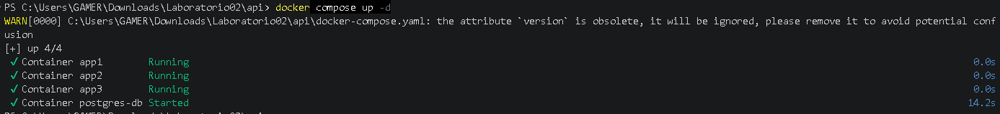
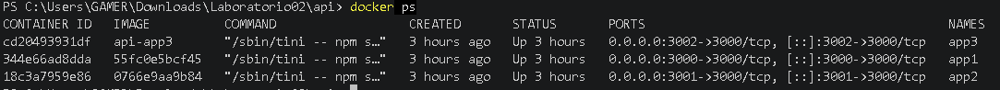
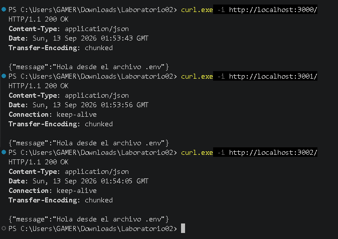
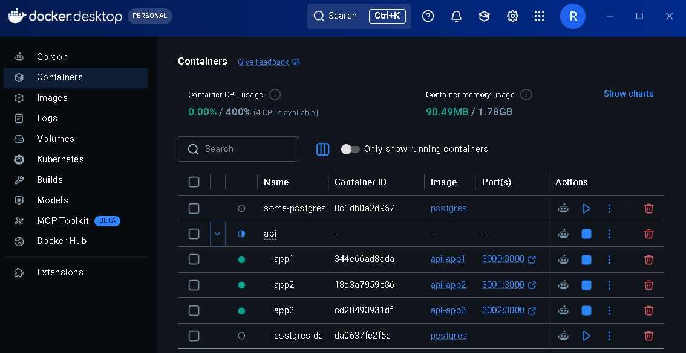
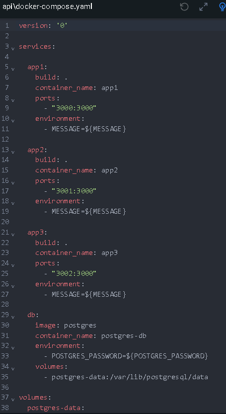

# Laboratorio 02

Hoy utilizaremos docker compose para poder desplegar su trabajo. Servicio web y una base de datos

# Stack

# API
El proyecto utiliza una API desarrollada con Node.js. La aplicación se ejecuta dentro de contenedores Docker y utiliza una imagen construida a partir del Dockerfile del proyecto.

Se implementaron tres copias de la API mediante Docker Compose, cada una utilizando un puerto diferente del equipo anfitrión.

# Base de datos
Para la base de datos se utiliza PostgreSQL mediante Docker. PostgreSQL se ejecuta en un contenedor independiente y utiliza un volumen para conservar los datos.

## Tecnologías utilizadas
- Node.js
- Docker
- Docker Compose
- PostgreSQL
BD
  - PostgreSQL
- $ docker run --name some-postgres -e POSTGRES_PASSWORD=mysecretpassword -d postgres

# Indicaciones

## Comandos
Clonamos el codigo fuente de la API:
git clone https://github.com/nmatsui/hello-world-api.git

## Despliegue
El proyecto se despliega utilizando Docker Compose.

El comando utilizado para iniciar todos los servicios es:

- docker compose up

## Configuración por entorno
El proyecto utiliza variables de entorno para configurar los servicios sin colocar directamente los valores dentro del archivo docker-compose.yaml.

Las variables utilizadas son:
MESSAGE=Hola desde el archivo .env
POSTGRES_PASSWORD=********

Levantar los builds y contenedores:
docker compose up --build

Revisar si los 4 contenedores esten ejecutandose:
docker compose ps

Probar cada instancia: (Al trabajarlo desde PowerShell el codigo era diferenete)
curl.exe -i http://localhost:3000/
curl.exe -i http://localhost:3001/
curl.exe -i http://localhost:3002/

# Tipos de Redes en Docker
Docker cuenta con diferentes tipos de redes que permiten establecer la comunicación entre contenedores y otros dispositivos.

## Bridge
Es la red predeterminada de Docker. Permite que los contenedores se comuniquen entre sí dentro del mismo host.

## Host
El contenedor utiliza directamente la red del equipo anfitrión. Esto reduce el aislamiento de red entre el contenedor y el host.

## None
El contenedor no tiene conectividad de red. Se utiliza cuando no se necesita comunicación de red.

## Overlay
Permite la comunicación entre contenedores que se encuentran en diferentes hosts Docker. Es utilizada principalmente en Docker Swarm.

## Macvlan
Permite que un contenedor tenga su propia dirección MAC y aparezca en la red física como un dispositivo independiente.

# Tipos de Volumen en Docker
Docker dispone de diferentes formas de almacenar información de los contenedores.

# Named Volumes
Son volúmenes administrados por Docker y tienen un nombre propio. Permiten conservar información aunque el contenedor sea eliminado.

## Bind Mounts
Permiten conectar directamente una carpeta o archivo del equipo anfitrión con una ubicación dentro del contenedor.

## Tmpfs
Almacena los datos temporalmente en la memoria del sistema. La información no permanece después de que el contenedor deja de ejecutarse.

# Evidencias

# Creditos
- Robert Visitación Junior Villar Vigo

